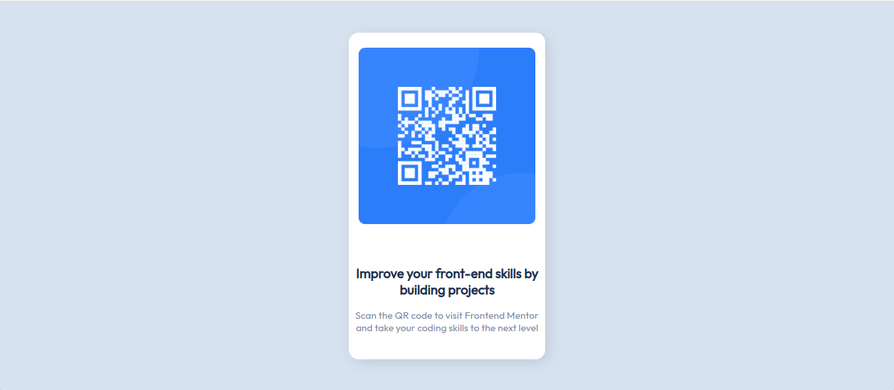

# QR Code Component Mini-Project

This is my solution for the [Frontend Mentor QR Code Component Challenge](https://www.frontendmentor.io/challenges/qr-code-component-iux_sIO_H/hub)with the goal of replicating a QR code component using HTML & CSS, based off the provided [Mobile](./resources/images/design-reference/mobile-design.jpg) & [Desktop](./resources/images/design-reference/desktop-design.jpg) images.

## Live Preview: https://br33dl0v3.github.io/miniproject_qr-code-component/

## Tools and Technologies

-   **HTML5** for creating the structure of the component
-   **CSS3** *(with use of Flexbox)* for styling the component 
-   **Google Fonts** for adding custom fonts
-   **Repl.it** for code editing

## Reflections
This project has helped me:
- Set up my first public project using github
- Taught me how to set up repositories on this website, modify changes and add commits, as well as produce my first README file. 
- Developed a better understanding of Flexbox
